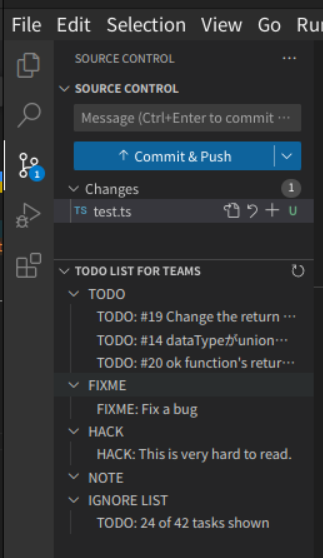

# Todo List for Teams

This extension provides Todo List on the source control. You can add todo items that you don't want to see to the ignore list.

It is designed to be used with git.

This was created for the purpose of excluding certain todo items in team development, such as other people's todo items.

## Features

- **Todo List View**: Display todo list on the source control. This supports `TODO`, `FIXME`, `HACK`, `NOTE` tags.
  - **Add to Ignore List**: Right-click on the todo item to add it to the ignore list. **Only committed items can use this feature.**
  - **Restore Item**: Right-click on a todo item in the ignore list to restore it.
  - **Reset**: Reset the todo list. This restores all items from the ignore list.

## Requirements

- Git must be installed and available in the PATH.
- VSCode must be open in a workspace with a git repository.

## Commands

- `Todo List for Teams: Reset`: Reset the todo list. This restores all items from the ignore list.

## Future Features

- **Highlighting**
  - Highlight todo items in the editor.
  - If you want this feature, please react or comment on [#3](https://github.com/senkenn/todo-list-for-teams/issues/3).
  - Until this one is supported, please use other extensions, such as [TODO Highlight](https://marketplace.visualstudio.com/items?itemName=wayou.vscode-todo-highlight).
- **Custom Tags**
  - Allow users to specify custom tags.
  - If you want this feature, please react or comment on [#4](https://github.com/senkenn/todo-list-for-teams/issues/4).

## Contributing

We welcome contributions! Please see [vsc-extension-quickstart.md](vsc-extension-quickstart.md) for details.

## License

[MIT](LICENSE)
